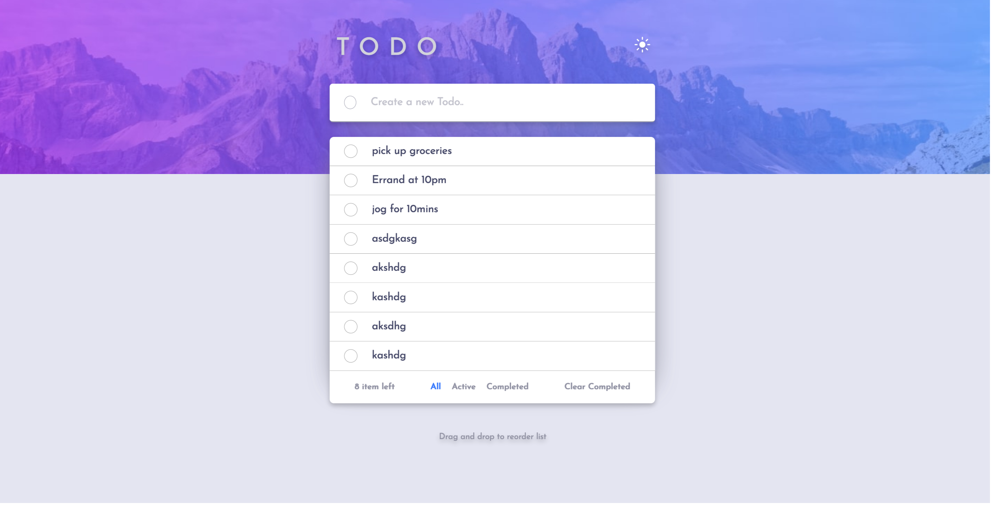

# Frontend Mentor - Todo app solution

This is a solution to the [Todo app challenge on Frontend Mentor](https://www.frontendmentor.io/challenges/todo-app-Su1_KokOW). Frontend Mentor challenges help you improve your coding skills by building realistic projects. 

## Table of contents

- [Overview](#overview)
  - [The challenge](#the-challenge)
  - [Screenshot](#screenshot)
  - [Links](#links)
- [My process](#my-process)
  - [Built with](#built-with)
  - [What I learned](#what-i-learned)
  - [Continued development](#continued-development)
  - [Useful resources](#useful-resources)
- [Author](#author)
- [Acknowledgments](#acknowledgments)

## Overview

### Screenshot

### Links

- Solution URL: [Frontend Mentor Solution Link](https://www.frontendmentor.io/solutions/todo-with-react-and-css-modules-with-theme-change-and-reorder-animae-SJasxMD4c
- Live Site URL: [https://dynamic-naiad-fcc6ab.netlify.app/](https://dynamic-naiad-fcc6ab.netlify.app/)

### The challenge

Users should be able to:

- See hover states for all interactive elements on the page
- Add new todos to the list
- Mark todos as complete
- Delete todos from the list
- Filter by all/active/complete todos
- Clear all completed todos
- Toggle light and dark mode
- **Bonus**: Drag and drop to reorder items on the list

## My process

### Built with

- Semantic HTML5 markup
- CSS custom properties
- Flexbox
- Mobile-first workflow
- [React](https://reactjs.org/) - JS library
- CSS Modules

#### Documentation

[Components and Flow](./todo-react/Components%20and%20Flow.md)

[CSS Design Plan](./todo-react//CSS%20Design%20Plan.md)

[State Management](./todo-react/State%20Management.md)

## Development Skills Learnt

- Planning state management at start is much more important than it seems to be
- Using Top-Bottom as compared to last time Bottom Up in Tic Tac Toe game.

## Author

- Website - [Nikesh Naik](https://www.nikeshnaik.dev)
- Frontend Mentor - [@nikeshnaik](https://www.frontendmentor.io/profile/nikeshnaik)
- Twitter - [@nikeshinfinity](https://www.twitter.com/nikeshinfinity)

